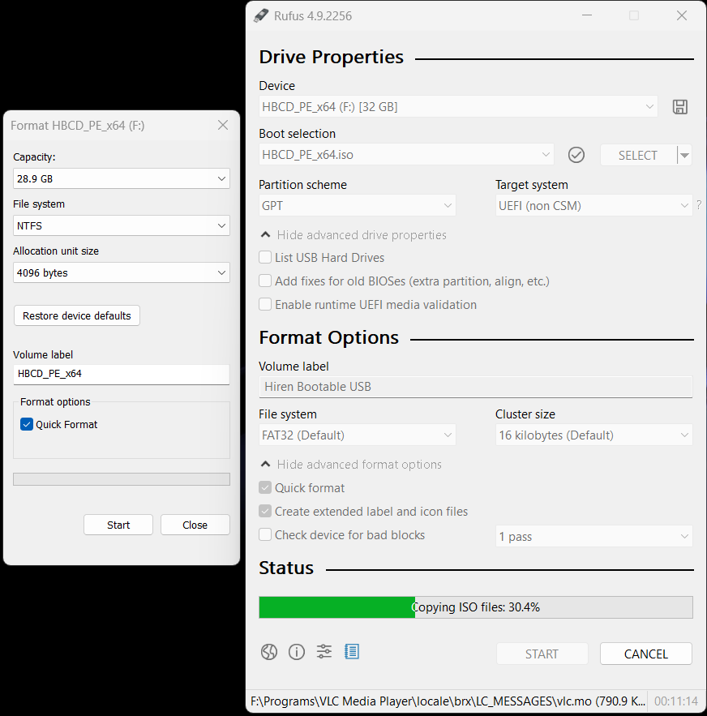

# 🔓 Windows Password Bypass & Data Recovery Using Hiren's Bootable USB

> **Authorized Cybersecurity & Digital Forensics Project**

A practical cybersecurity project demonstrating how physical access to a Windows endpoint can expose an offline attack surface when boot security and full-disk encryption are not properly configured.

The project uses **Hiren's BootCD PE** as a bootable recovery environment to demonstrate offline Windows account recovery, access to user data, and deleted-file recovery.

---

## 📌 Project Overview

Traditional Windows authentication protects access to the operating system while it is running. However, if an attacker obtains physical access to a device and can boot an alternative operating environment, the security boundary can change significantly.

In this project, an authorized Windows test system was booted using a **Hiren's BootCD PE USB**. The exercise demonstrated:

- Creating a bootable Hiren's BootCD PE USB
    
- Booting a Windows system through the boot/firmware menu
    
- Accessing the Windows system drive from an external PE environment
    
- Demonstrating offline Windows account/password recovery
    
- Accessing and backing up user data
    
- Recovering deleted files using Recuva Wizard
    
- Examining the security implications of physical access
    
- Identifying defensive controls such as BitLocker and boot security
    

---

## 🎯 Objectives

The primary objectives of this project were:

- Understand physical and offline attack surfaces against Windows endpoints.
    
- Demonstrate the security implications of an unencrypted Windows system drive.
    
- Explore offline Windows account recovery mechanisms.
    
- Practice basic data recovery and deleted-file recovery.
    
- Understand how boot security affects endpoint security.
    
- Identify defensive measures that can reduce the impact of physical access.
    

---

## 🛠️ Tools & Technologies

|Tool / Technology|Purpose|
|---|---|
|**Hiren's BootCD PE**|Bootable Windows PE/recovery environment|
|**Rufus**|Creating the bootable USB|
|**NT Password Edit**|Offline Windows account/password recovery|
|**Windows Login Unlocker**|Windows account recovery/unlocking|
|**Recuva Wizard**|Deleted-file recovery|
|**BIOS / UEFI**|Boot-device configuration|
|**External USB Storage**|Data backup and recovery destination|

---

# 🔄 Project Workflow

```text
                    Windows Endpoint
                           │
                           ▼
              Download Hiren's BootCD PE
                           │
                           ▼
                  Flash ISO using Rufus
                           │
                           ▼
                Boot Windows from USB
                           │
              ┌────────────┴────────────┐
              │                         │
              ▼                         ▼
      Offline Account Access       Data Recovery
              │                         │
              ▼                         ▼
     NT Password Edit /             User Data
     Windows Login Unlocker          Backup
              │                         │
              └────────────┬────────────┘
                           ▼
                   Deleted File Recovery
                           │
                           ▼
                      Recuva Wizard
                           │
                           ▼
                   External Storage
```

---

# 1. 💾 Creating the Hiren's Bootable USB

The first stage involved obtaining the Hiren's BootCD PE ISO and using Rufus to create bootable recovery media.

### Tools

- Hiren's BootCD PE
    
- Rufus
    
- USB flash drive
    

### Project Evidence





---

# 2. 🖥️ Booting the Windows System

After preparing the USB, the authorized test system was restarted and configured to boot from the Hiren's BootCD PE media.

The exact boot key and firmware interface depend on the computer manufacturer and model.

### Project Evidence


Once Hiren's BootCD PE loaded, the Windows system volume could be accessed from the PE environment.

---

# 3. 🔐 Offline Windows Account Recovery

The project evaluated offline Windows account recovery using tools available within the Hiren's BootCD PE environment.

Two utilities were examined:

### NT Password Edit

NT Password Edit was used to interact with Windows account information from the offline Windows installation.


### Windows Login Unlocker

Windows Login Unlocker was also examined as an offline account-recovery utility.


> This procedure was performed on an authorized test system for educational and security-testing purposes.

---

# 4. 📂 Windows User Data Access

After booting into the PE environment, the Windows system drive could be examined independently of the normal Windows login screen.

The project demonstrated navigating to the Windows user directories and copying required data to external storage.

Typical user data locations include:

```text
C:\Users\
```

### Project Evidence


This demonstrates an important security consideration: **OS login protection alone does not provide strong protection for data stored on an unencrypted drive against an attacker with sufficient physical access.**

---

# 5. ♻️ Deleted File Recovery

The project also examined deleted-file recovery using **Recuva Wizard**.

The recovery workflow included selecting:

1. The type of file to recover
    
2. The location to search
    
3. The recovery process
    

File types could include categories such as:

- Pictures
    
- Documents
    
- Videos
    
- Emails
    
- Other supported file types
    

### Project Evidence


---

# 🔎 Security Analysis

The project demonstrates an important endpoint-security principle:

> **Physical access can significantly weaken operating-system-level security when an attacker can boot an alternative environment and the storage device is not protected by full-disk encryption.**

Without appropriate storage encryption and boot security, an attacker with physical access may potentially be able to:

- Access files stored on the Windows system drive
    
- Attempt offline account recovery
    
- Copy sensitive user data
    
- Attempt recovery of deleted files
    
- Modify files on the offline Windows installation
    

The exact impact depends on the device configuration, encryption status, firmware protections, and other security controls.

---

# 🛡️ Defensive Measures

The project highlights several defensive controls that organizations and individual users should consider.

## 1. BitLocker / Full-Disk Encryption

Enable **BitLocker** or another appropriate full-disk encryption solution.

Encryption helps protect data at rest when an attacker obtains physical access to the device or attempts to boot another operating environment.

---

## 2. UEFI / BIOS Security

Protect firmware configuration with an appropriate administrator password and review available boot-security settings.

---

## 3. Restrict External Boot

Where operationally appropriate, restrict unauthorized booting from USB or other external devices.

---

## 4. Secure Boot

Use **UEFI Secure Boot** where supported and appropriate to help ensure that only trusted boot components are executed.

---

## 5. Protect Recovery Keys

Recovery keys should be stored securely and separately from the endpoint.

Organizations should also test their recovery procedures before relying on them during an incident.

---

## 6. Physical Security

Physical security is an important part of endpoint security.

Lost or stolen devices should be treated as potentially compromised, particularly when full-disk encryption is not enabled.

---

## 7. Backups

Maintain tested backups so important information can be recovered without relying exclusively on the local endpoint.

---

# 🧠 Key Cybersecurity Concepts Demonstrated

This project provided practical exposure to:

- Physical attack surfaces
    
- Offline attacks
    
- Windows endpoint security
    
- Boot security
    
- BIOS / UEFI security
    
- Full-disk encryption
    
- BitLocker
    
- Digital forensics
    
- Data recovery
    
- Deleted-file recovery
    
- Endpoint hardening
    
- Physical security
    

---

# 📊 Project Impact

The exercise improved practical understanding of:

- How physical access changes the threat model of an endpoint
    
- Why OS authentication should not be considered the only layer of protection
    
- The importance of full-disk encryption
    
- The relationship between boot security and endpoint security
    
- Basic digital-forensics and data-recovery workflows
    

---

# 📁 Repository Structure

```text
windows-password-bypass-data-recovery/
│
├── README.md
│
├── images/
│   ├── hirens-boot-iso-and-rufus.png
│   ├── rufus.png
│   ├── hiren-bootable-usb-files.jpg
│   ├── windows-boot-menu.png
│   ├── nt-password-edit.jpg
│   ├── nt-password-edit-2.jpg
│   ├── windows-login-unlocker.jpg
│   ├── windows-login-unlocker-2.jpg
│   ├── data-recovery.jpg
│   ├── data-recovery-file-location.jpg
│   ├── recuva-wizard.jpg
│   ├── recuva-wizard-file-type.jpg
│   └── capture.jpg
│
└── docs/
    ├── methodology.md
    └── defensive-controls.md
```

---

# ⚠️ Responsible Use

This project is intended for:

- Authorized cybersecurity testing
    
- Digital-forensics education
    
- Endpoint-security research
    
- Recovery of systems and data that you are authorized to access
    
- Security-awareness training
    

Do **not** use these techniques to bypass authentication, access data, or modify systems without appropriate authorization.

---

# 📚 References

- Hiren's BootCD PE
    
- Rufus
    
- Recuva
    
- Microsoft BitLocker
    
- UEFI / Secure Boot
    

---

⭐ If you found this project useful, consider starring the repository.